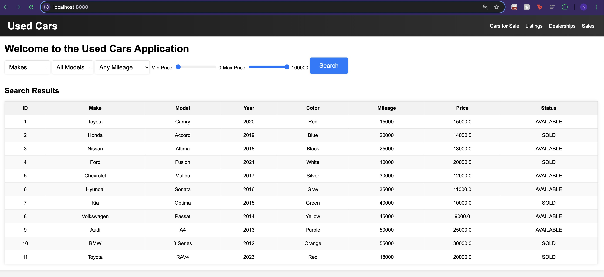
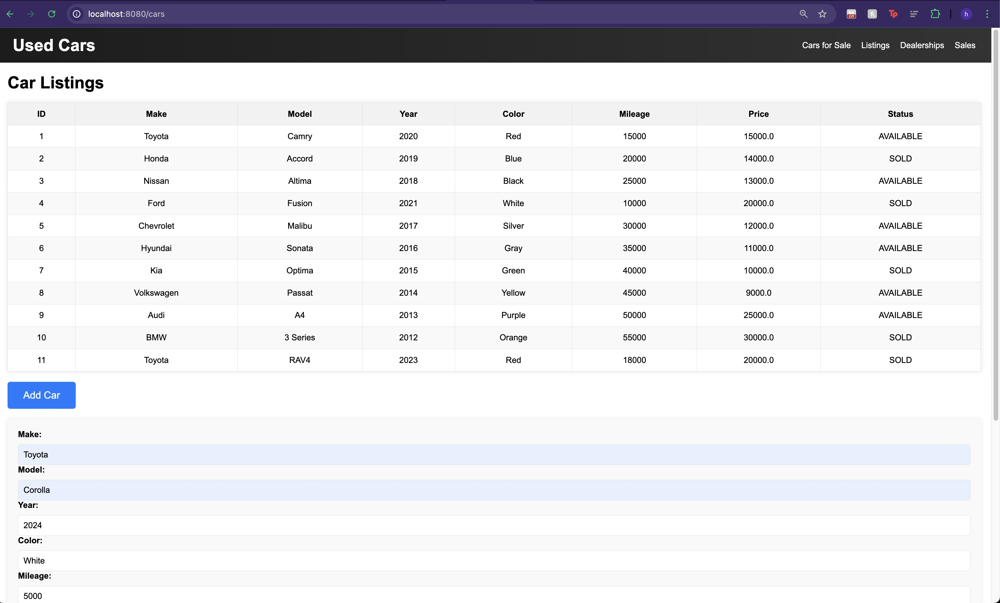
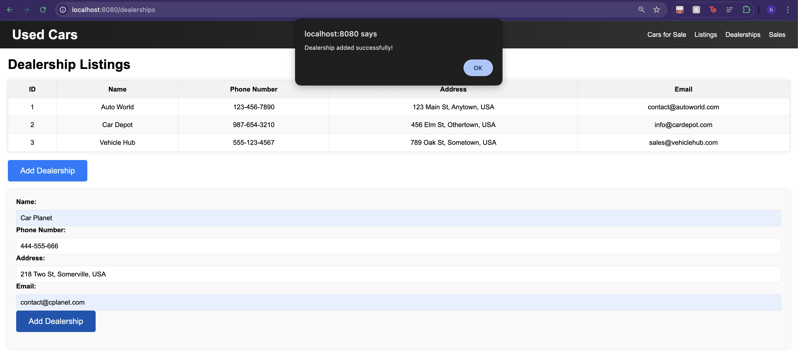

# Car Web Application

Welcome to the Car Web Application! This application allows users to search for used cars based on various criteria such as make, model, price, and mileage. It also provides functionalities for adding, updating, and deleting car listings.

## Features

- **Search Cars**: Users can search for cars based on make, model, price range, and mileage.
- **Add Car**: Admins can add new car listings with details such as make, model, year, color, mileage, VIN, status, and price.
- **Update Car**: Admins can update existing car listings by providing the car ID and modifying the details.
- **Delete Car**: Admins can delete car listings by providing the car ID.
- **View Listings**: Users can view all car listings in a tabular format.

## Technologies Used

- **Backend**: Spring Boot
- **Frontend**: Thymeleaf, HTML, CSS, JavaScript
- **Database**: Spring Data JDBC, MYSQL
- **Containerization**: Docker

## Getting Started

### Prerequisites

- Java 11 or higher
- Maven
- A database (e.g., MySQL)

### Installation

1. **Clone the repository**:
    
    git clone https://github.com/senghengkim/Usedcarwebapp
    cd car-web-application
    

2. **Configure the database**:
    - Update the `application.properties` file with your database configuration.

3. **Build the application**:
    mvn clean install

4. **Run the application**:
    mvn spring-boot:run

### Using Docker

1. **Build the Docker image**:
    docker build -t car-web-application .
    
2. **Run the Docker container**:
    docker run -d -p 8080:8080 --name car-web-application car-web-application
    
3. **Access the application**:
    - Open your web browser and navigate to `http://localhost:8080`.

### Usage

1. **Access the application**:
    - Open your web browser and navigate to `http://localhost:8080`.

2. **Search for cars**:
    - Use the search form on the homepage to filter cars by make, model, price range, and mileage.

    
3. **Add a new car**:
    - Click on the "Add Car" button, fill out the form, and submit to add a new car listing.
    

4. **Update an existing car**:
    - Click on the "Update Car" button, provide the car ID, and modify the details in the form.
    

5. **Delete a car**:
    - Provide the car ID and delete the car listing.

### Project Structure

- **src/main/java/com/example/usedcars**: Contains the Java source code.
    - **car**: Contains the car-related classes and controllers.
    - **web**: Contains the web controllers.
    - **sale**: Contains the sale-related classes and controllers.
    - **dealership**: Contains the dealership-related classes and controllers.
    - **listing**: Contains the listing-related classes and controllers.
- **src/main/resources/templates**: Contains the Thymeleaf templates and HTML files
- **src/main/resources/static/css**: Contains the CSS files.
- **src/main/resources/static/js**: Contains the JavaScript files.
- **src/main/resources/application.properties**: Contains the application configuration.

### API Endpoints
- **Examples are for Car's Data only**
- **GET /api/cars**: Retrieve all cars.
- **GET /api/cars/{id}**: Retrieve a car by ID.
- **POST /api/cars**: Create a new car.
- **PUT /api/cars/{id}**: Update an existing car.
- **DELETE /api/cars/{id}**: Delete a car by ID.
- **GET /api/cars/makes**: Retrieve all car makes.
- **GET /api/cars/models/{make}**: Retrieve all models for a specific make.

### Database Design

The database consists of the following tables:

- **Car**: Stores car details such as make, model, year, price, color, mileage, VIN, and status.
- **Dealership**: Stores dealership details such as name, phone number, address, and email.
- **Listing**: Stores listing details such as car ID, description, price, date, and dealership ID.
- **Sale**: Stores sale details such as sale date, sale price, payment method, and listing ID.

### Project Report

This project includes both front-end UI using Thymeleaf, HTML, CSS and Javascript and back-end services using Spring Data JDBC which includes the CRUD operation already. The Data are then entered through SQL command such as CREATE TABLE, INSERT INTO TABLE. Firstly, testing out the backend status using Postman to test API. Then connecting it with a container using docker desktop to ensure efficiency and portability when working on the project. Next, creating the front end services using HTML, javascript and CSS for style. When implementing each new query, we must make changes to the controller for each of the data we're accessing. Some features in the application includes the ability to query the car's make, model, price, and mileage together or independently. To further scale the application, we could introduce more variable such as querying with color, status, year, etc. We could also introduce unique pictures for each of the car so the application UI is more enhancing.

### License

This project is licensed under the MIT License. See the [LICENSE](LICENSE) file for details.